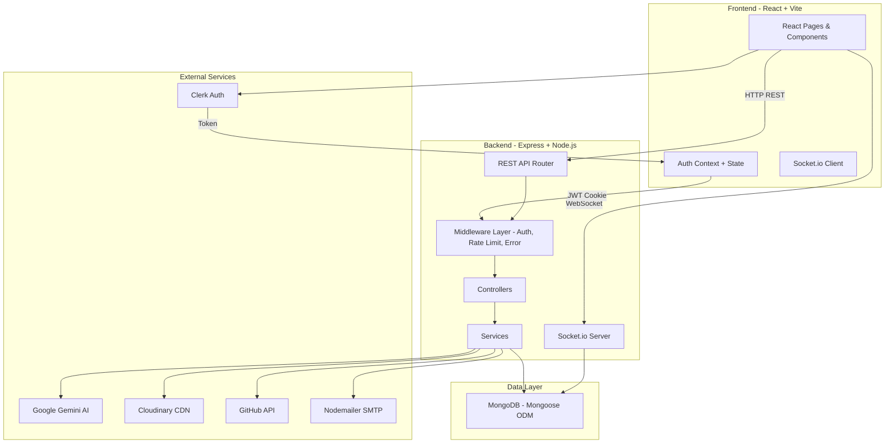
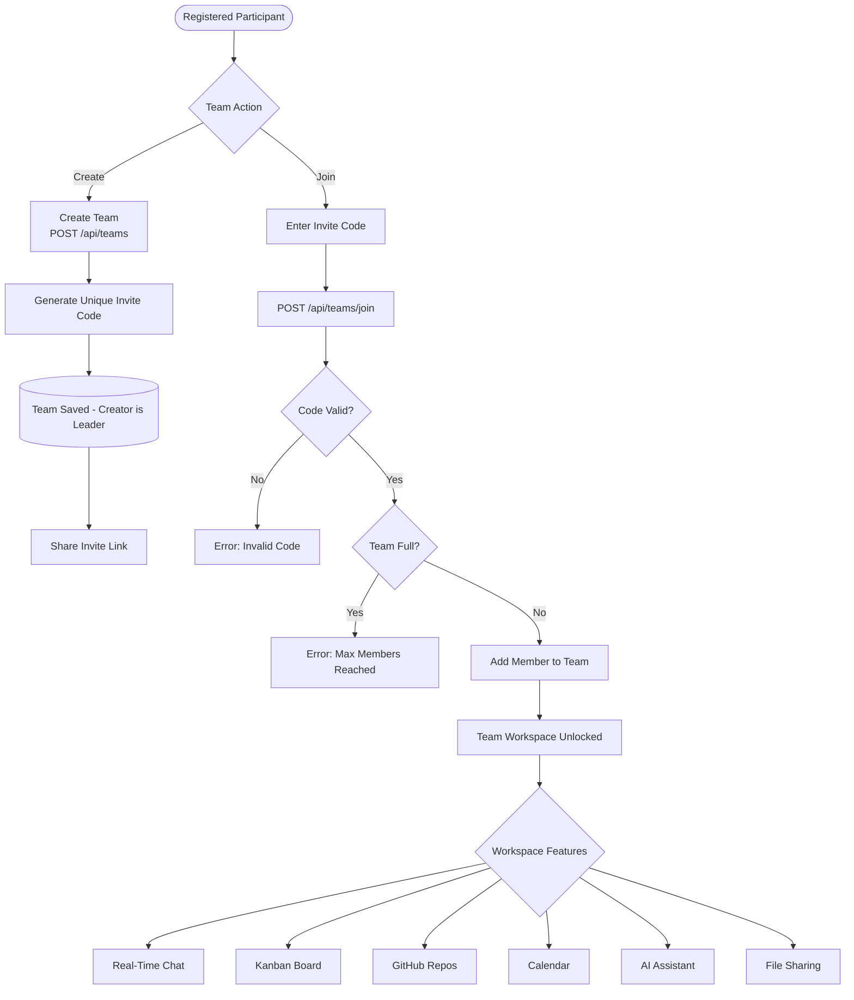
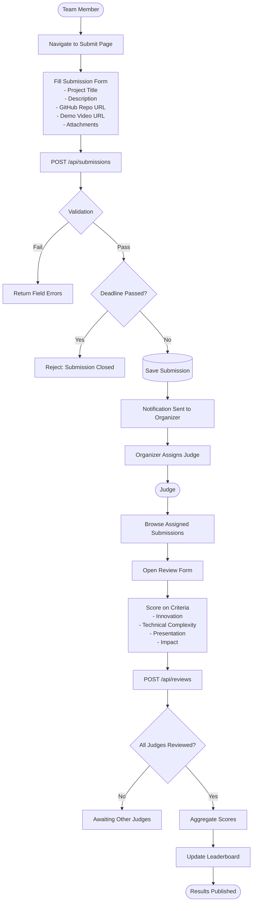
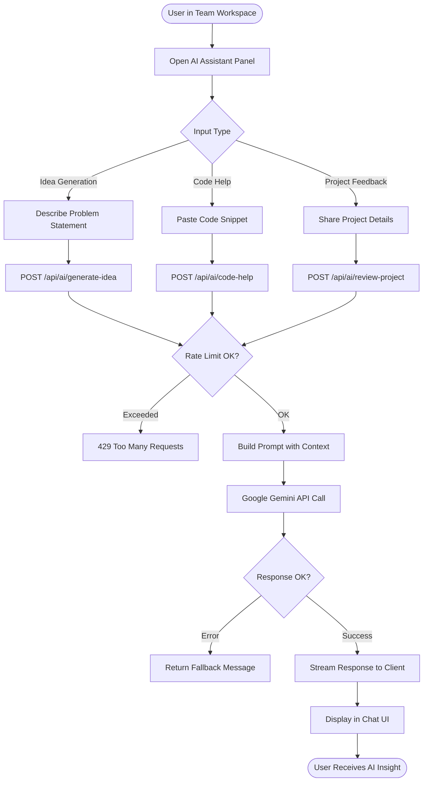
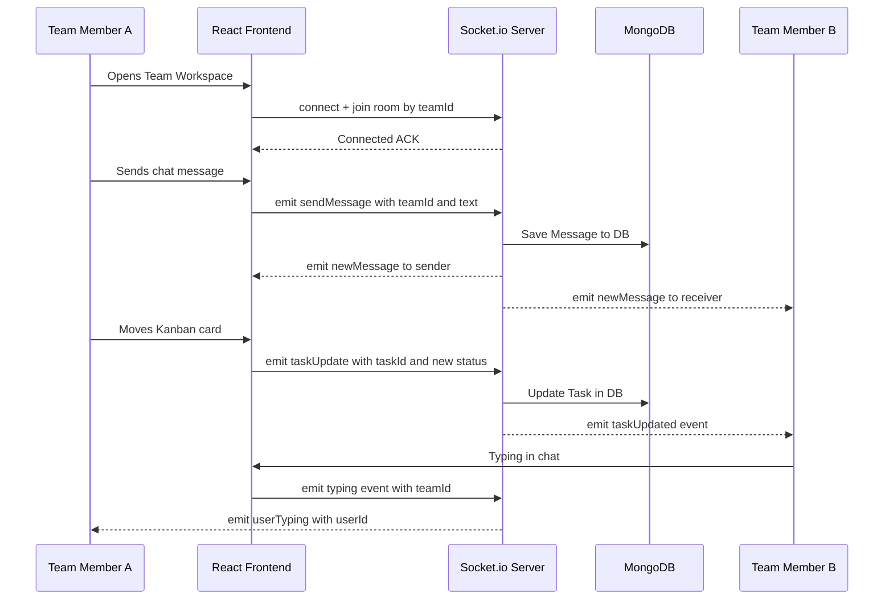
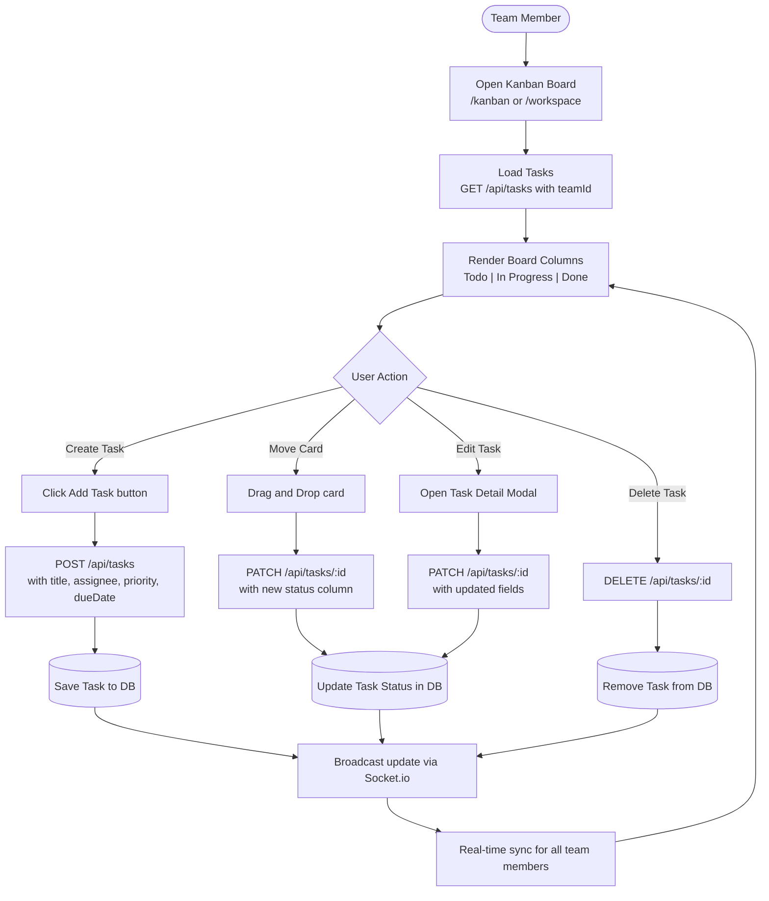
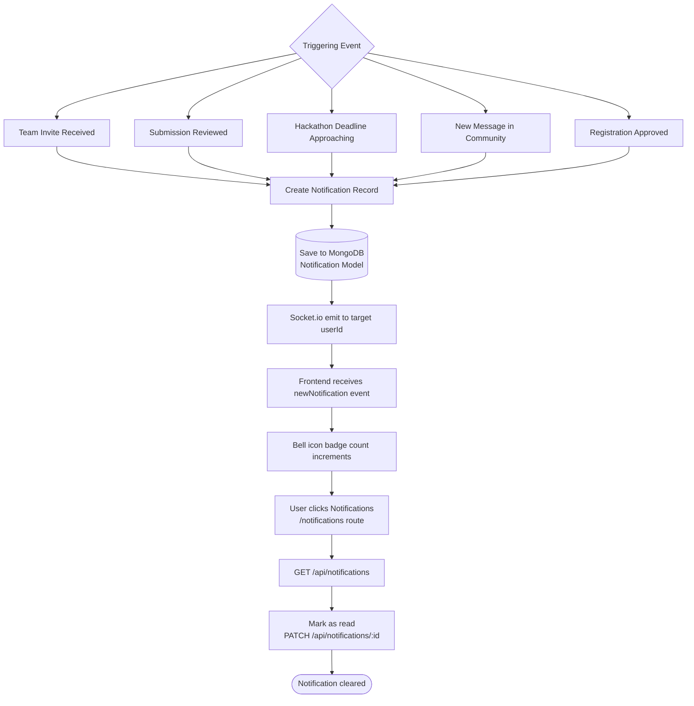

<div align="center">

# 🚀 CodeSprint

### The All-in-One Hackathon Management Platform

[](LICENSE)
[](https://nodejs.org)
[](https://react.dev)
[](https://www.mongodb.com)
[](https://expressjs.com)
[](https://vitejs.dev)
[](https://socket.io)

**CodeSprint** is a full-stack MERN hackathon management platform that provides end-to-end tools for organizers, participants, and judges — from hackathon discovery and team formation to AI-assisted submissions, real-time collaboration, leaderboards, and GitHub integration.

[Live Demo](#) · [Report Bug](https://github.com/animeshtripathii/CodeSprint/issues) · [Request Feature](https://github.com/animeshtripathii/CodeSprint/issues)

</div>

---

## 📋 Table of Contents

- [Overview](#-overview)
- [Tech Stack](#-tech-stack)
- [Feature Highlights](#-feature-highlights)
- [Architecture](#-system-architecture)
- [Workflow Charts](#-workflow-charts)
  - [Authentication Flow](#1️⃣-authentication-flow)
  - [Hackathon Lifecycle](#2️⃣-hackathon-lifecycle)
  - [Team Formation Flow](#3️⃣-team-formation-flow)
  - [Submission & Review Flow](#4️⃣-submission--review-flow)
  - [AI Assistant Flow](#5️⃣-ai-assistant-flow)
  - [Real-Time Collaboration Flow](#6️⃣-real-time-collaboration--team-workspace)
  - [Leaderboard & Scoring Flow](#7️⃣-leaderboard--scoring-flow)
  - [GitHub Integration Flow](#8️⃣-github-integration-flow)
  - [Kanban & Task Management Flow](#9️⃣-kanban--task-management-flow)
  - [Notification Flow](#-notification-flow)
- [Getting Started](#-getting-started)
- [Environment Variables](#-environment-variables)
- [API Reference](#-api-reference)
- [Project Structure](#-project-structure)
- [Deployment](#-deployment)
- [Contributing](#-contributing)
- [License](#-license)

---

## 🌟 Overview

CodeSprint eliminates the fragmented experience of running and participating in hackathons. Instead of juggling Discord for teams, Google Forms for registration, GitHub for code, and spreadsheets for judging — CodeSprint unifies everything in one intelligent platform.

| Role | What They Get |
|------|---------------|
| 🏢 **Organizer** | Create hackathons, manage registrations, review submissions, publish results |
| 👥 **Participant** | Discover & join hackathons, form teams, collaborate in real time, submit projects |
| ⚖️ **Judge** | Review assigned submissions, score projects, leave detailed feedback |
| 🛡️ **Admin** | Manage all users, oversee platform activity |

---

## 🛠 Tech Stack

### Backend

| Technology | Purpose |
|---|---|
| **Node.js + Express v5** | REST API server |
| **MongoDB + Mongoose** | Database & ODM |
| **Socket.io v4** | Real-time messaging & notifications |
| **JWT + Bcrypt** | Authentication & password hashing |
| **Clerk** | SSO / OAuth provider |
| **Cloudinary + Multer** | File & image uploads |
| **Google Generative AI** | AI-powered assistant |
| **Nodemailer** | Email notifications |
| **Morgan + Rate Limiter** | Logging & API protection |

### Frontend

| Technology | Purpose |
|---|---|
| **React 19 + Vite 8** | UI framework & build tool |
| **React Router v7** | Client-side routing |
| **Tailwind CSS v4** | Utility-first styling |
| **Framer Motion + GSAP** | Animations & transitions |
| **Three.js + R3F** | 3D landing page visuals |
| **Socket.io Client** | Real-time updates |
| **Clerk React** | Auth UI components |
| **React Hot Toast** | Toast notifications |
| **Lucide + React Icons** | Icon library |

---

## ✨ Feature Highlights

- 🔐 **Multi-provider Auth** — Email/password + GitHub/Google OAuth via Clerk
- 🏆 **Hackathon Management** — Full CRUD lifecycle for hackathons with prize tracking
- 👥 **Team Formation** — Create or join teams with invite links
- 💬 **Real-Time Chat** — Private DMs and community chat powered by Socket.io
- 🤖 **AI Assistant** — Google Gemini-powered project ideation and code help
- 📋 **Kanban Board** — Drag-and-drop task management per team
- 📅 **Calendar** — Event timeline and deadline tracker
- 🧑‍⚖️ **Judge Panel** — Assign judges, submit reviews, multi-criteria scoring
- 🥇 **Leaderboard** — Real-time dynamic rankings
- 🐙 **GitHub Integration** — Browse repos and file trees directly in the platform
- 📊 **Dashboard** — Personalized stats for participants and organizers
- 🔔 **Notifications** — In-app and real-time event notifications
- ☁️ **File Uploads** — Project assets via Cloudinary
- 🌐 **Community Hub** — Cross-hackathon discussion board

---

## 🏗 System Architecture



---

## 📊 Workflow Charts

### 1️⃣ Authentication Flow

```mermaid
flowchart TD
    A([User Visits App]) --> B{Has Account?}
    B -->|No| C[Register Page]
    B -->|Yes| D[Login Page]

    C --> E{Auth Method}
    E -->|Email and Password| F[Fill Registration Form]
    E -->|GitHub or Google| G[OAuth via Clerk SSO]

    F --> H[POST /api/auth/register]
    H --> I{Validation OK?}
    I -->|No| J[Return Errors]
    I -->|Yes| K[Hash Password - Create User]
    K --> L[Issue JWT Cookie]

    G --> M[Clerk SSO Callback]
    M --> N[/sso-callback route]
    N --> O{Existing User?}
    O -->|No| P[Auto-create User Record]
    O -->|Yes| Q[Load Profile]
    P --> L
    Q --> L

    D --> R[POST /api/auth/login]
    R --> S{Credentials Valid?}
    S -->|No| T[401 Unauthorized]
    S -->|Yes| L

    L --> U[JWT stored in HttpOnly Cookie]
    U --> V[Redirect to /dashboard]
    V --> W([Authenticated Session])
```

---

### 2️⃣ Hackathon Lifecycle

```mermaid
flowchart LR
    A([Organizer]) --> B["Create Hackathon\nPOST /api/hackathons"]
    B --> C{Validation}
    C -->|Fail| D[Return Errors]
    C -->|Pass| E[(Save to MongoDB)]

    E --> F[Status: UPCOMING]
    F --> G["Browse Hackathons\nGET /api/hackathons"]
    G --> H[View Detail Page]

    H --> I["Register\nPOST /api/registrations"]
    I --> J{Already Registered?}
    J -->|Yes| K[Block Duplicate]
    J -->|No| L[Create Registration Record]

    L --> M[Join or Create Team]
    M --> N[Status: ONGOING]

    N --> O["Submit Project\nPOST /api/submissions"]
    O --> P["Judges Review\nPOST /api/reviews"]
    P --> Q[Scores Computed]
    Q --> R[Status: ENDED]
    R --> S["Leaderboard Published\nGET /api/leaderboard"]
    S --> T([Winners Announced])
```



---

### 3️⃣ Team Formation Flow



---

### 4️⃣ Submission & Review Flow



---

### 5️⃣ AI Assistant Flow



---

### 6️⃣ Real-Time Collaboration — Team Workspace



---

### 7️⃣ Leaderboard & Scoring Flow


---

### 8️⃣ GitHub Integration Flow

```mermaid
flowchart TD
    A([User in Repositories Page]) --> B[GET /api/github/repos]
    B --> C{GitHub Token Present?}
    C -->|No| D[Prompt: Connect GitHub Account]
    C -->|Yes| E[Fetch Repos via GitHub API Proxy]

    E --> F[/api/github proxy endpoint]
    F --> G[GitHub REST API]
    G --> H[Return Repo List]
    H --> I[Display RepositoriesPage]

    I --> J[User Selects a Repo]
    J --> K[Navigate to /repositories/:owner/:repo]
    K --> L[Fetch File Tree via /api/github/tree]
    L --> M[Render RepoTreePage]

    M --> N{User Action}
    N -->|Browse Folder| O[Expand tree node]
    N -->|View File| P[Fetch file content via /api/github/blob]
    P --> Q[Syntax highlighted file preview]
    N -->|Link to Submission| R[Save Repo URL in Submission record]
```

---

### 9️⃣ Kanban & Task Management Flow



---

### 🔔 Notification Flow



---

## 🚀 Getting Started

### Prerequisites

- **Node.js** v20+
- **npm** v9+
- **MongoDB** (local or Atlas)
- **Clerk** account (for auth)
- **Cloudinary** account (for uploads)
- **Google AI Studio** API key (for AI features)

### Clone the Repository

```bash
git clone https://github.com/animeshtripathii/CodeSprint.git
cd CodeSprint
```

### Backend Setup

```bash
cd backend
cp .env.example .env       # Fill in your environment variables
npm install
npm run dev                # Starts on http://localhost:5000
```

### Frontend Setup

```bash
cd frontend
cp .env.example .env       # Fill in your environment variables
npm install
npm run dev                # Starts on http://localhost:5173
```

---

## 🔧 Environment Variables

### Backend (`backend/.env`)

| Variable | Description |
|---|---|
| `MONGO_URI` | MongoDB connection string |
| `JWT_SECRET` | Secret for signing JWT tokens |
| `CLERK_SECRET_KEY` | Clerk backend secret key |
| `CLOUDINARY_CLOUD_NAME` | Cloudinary cloud name |
| `CLOUDINARY_API_KEY` | Cloudinary API key |
| `CLOUDINARY_API_SECRET` | Cloudinary API secret |
| `GOOGLE_AI_API_KEY` | Google Gemini API key |
| `CLIENT_URL` | Frontend origin URL |
| `GITHUB_CLIENT_ID` | GitHub OAuth app client ID |
| `GITHUB_CLIENT_SECRET` | GitHub OAuth app secret |
| `SMTP_HOST` | Email SMTP host |
| `SMTP_USER` | Email SMTP username |
| `SMTP_PASS` | Email SMTP password |

### Frontend (`frontend/.env`)

| Variable | Description |
|---|---|
| `VITE_CLERK_PUBLISHABLE_KEY` | Clerk publishable key |
| `VITE_API_BASE_URL` | Backend API base URL |
| `VITE_SOCKET_URL` | Socket.io server URL |

---

## 📡 API Reference

| Module | Base Path | Key Endpoints |
|---|---|---|
| Auth | `/api/auth` | `POST /register`, `POST /login`, `POST /logout` |
| Users | `/api/users` | `GET /me`, `PATCH /me`, `GET /:id` |
| Hackathons | `/api/hackathons` | `GET /`, `POST /`, `GET /:id`, `PATCH /:id` |
| Registrations | `/api/registrations` | `POST /`, `GET /my` |
| Teams | `/api/teams` | `POST /`, `POST /join`, `GET /:id` |
| Submissions | `/api/submissions` | `POST /`, `GET /:id`, `PATCH /:id` |
| Reviews | `/api/reviews` | `POST /`, `GET /submission/:id` |
| Leaderboard | `/api/leaderboard` | `GET /:hackathonId` |
| Dashboard | `/api/dashboard` | `GET /participant`, `GET /organizer` |
| Tasks | `/api/tasks` | `GET /`, `POST /`, `PATCH /:id`, `DELETE /:id` |
| Messages | `/api/messages` | `GET /:teamId`, `POST /` |
| AI | `/api/ai` | `POST /generate-idea`, `POST /code-help` |
| GitHub | `/api/github` | `GET /repos`, `GET /tree`, `GET /blob` |
| Community | `/api/community` | `GET /messages`, `POST /messages` |

---

## 📁 Project Structure

```
CodeSprint/
├── backend/
│   ├── config/          # DB connection, Cloudinary config
│   ├── controllers/     # Route handler logic
│   ├── middleware/      # Auth, error handler, rate limiter
│   ├── models/          # Mongoose schemas
│   │   ├── User.js
│   │   ├── Hackathon.js
│   │   ├── Team.js
│   │   ├── Submission.js
│   │   ├── Review.js
│   │   ├── Task.js
│   │   ├── Message.js
│   │   ├── Notification.js
│   │   └── CommunityMessage.js
│   ├── routes/          # Express route definitions (15 modules)
│   ├── services/        # Business logic, AI, email
│   ├── utils/           # Seed scripts, helpers
│   ├── app.js           # Express app configuration
│   └── server.js        # HTTP + Socket.io server entry
│
└── frontend/
    ├── public/
    └── src/
        ├── components/  # Reusable UI components
        ├── context/     # AuthContext
        ├── lib/         # Utility functions
        ├── pages/       # 22 route-level page components
        ├── services/    # API service functions
        ├── store/       # State management
        ├── App.jsx      # Router configuration
        └── main.jsx     # React entry point
```

---

## ☁️ Deployment

| Layer | Platform |
|---|---|
| Frontend | **Vercel** (auto-deploy via `vercel.json`) |
| Backend | **Render / Railway / Fly.io** |
| Database | **MongoDB Atlas** |
| Media | **Cloudinary** |

---

## 🤝 Contributing

Contributions are welcome! Please follow these steps:

1. Fork the repository
2. Create your feature branch: `git checkout -b feature/amazing-feature`
3. Commit your changes: `git commit -m 'feat: add amazing feature'`
4. Push to the branch: `git push origin feature/amazing-feature`
5. Open a Pull Request

---

## 📄 License

This project is licensed under the **MIT License** — see the [LICENSE](LICENSE) file for details.

---

<div align="center">

Built with ❤️ by **Animesh Tripathi**

⭐ Star this repo if you find it useful!

</div>
